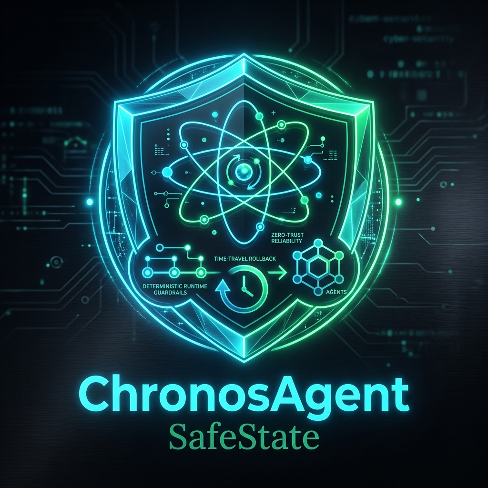
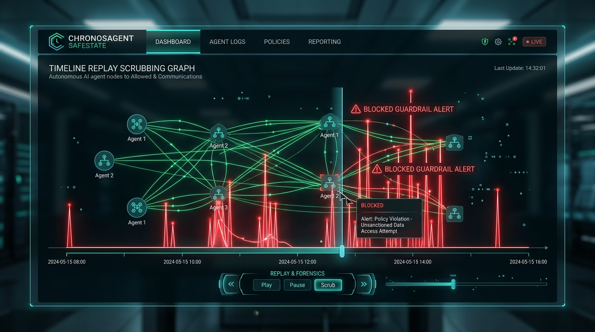
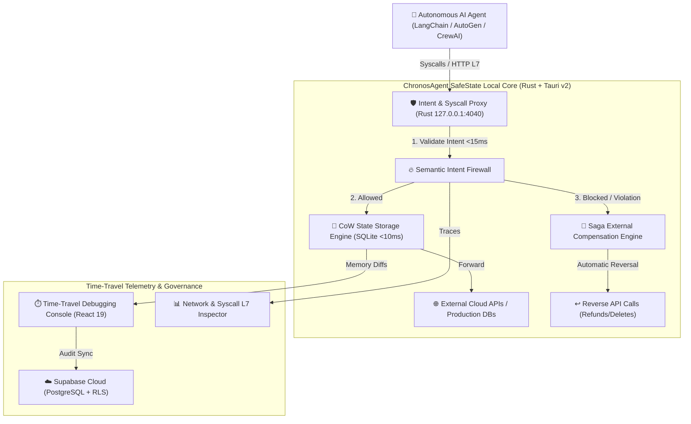

# 🛡️ ChronosAgent SafeState

<div align="center">
  
  <h3>Zero-Trust Runtime Guardrail, Time-Travel Replay & Saga Compensations for Autonomous AI Agents</h3>
  <p><strong>Local-First Architecture • Sub-15ms Intent Firewall • Offline Ed25519 Cryptographic Licensing</strong></p>
</div>

---

<div align="center">
  
</div>

---

## 📌 1. Executive Summary & Purpose

Autonomous AI agents (powered by LLMs such as GPT-4o, Claude 3.5 Sonnet, or Llama 3) dynamically synthesize code, execute shell commands, and interact with external APIs in real-time. This dynamic autonomy creates severe operational risks:
- **Catastrophic Hallucinations:** Unintended file system deletions (`rm -rf`) or database corruption (`DROP TABLE`).
- **Uncontrolled Financial Side Effects:** Accidental duplicate charges or runaway third-party API consumption.
- **Production Vulnerabilities:** Exploitation of system credentials without determinism.

**ChronosAgent SafeState** solves these challenges by deploying a **Local-First Zero-Trust Runtime Guardrail**. Every action, network request, and syscall proposed by an agent is intercepted prior to system consolidation, differential Copy-on-Write (CoW) memory snapshots are captured in sub-10ms, semantic intent is validated against strict security policies in sub-15ms, and automatic bidirectional Saga rollbacks are triggered upon policy violation.

---

## 🏗️ 2. Modular Architecture & Deep-Dive



### The 5 Core Subsystems:
1. **Agent Sandbox Runtime:** Lightweight process and WebAssembly isolation ensuring zero unmonitored execution.
2. **Intent & Syscall Proxy (Rust):** Low-latency L7 HTTP/gRPC local proxy daemon listening on `127.0.0.1:4040`.
3. **CoW State Storage Engine:** Ultra-fast local SQLite database capturing differential memory and transaction deltas in under 10ms.
4. **Saga External Compensation Engine:** Graph-based bidirectional rollback orchestrator executing compensating actions (e.g. `POST /v1/charges` ➔ `POST /v1/refunds`).
5. **Time-Travel Debugging Console:** High-precision graphical UI in React 19 and TailwindCSS for step-back/step-forward forensic inspection and replay.

---

## 🔑 3. Offline Cryptographic Licensing (Ed25519)

ChronosAgent SafeState includes commercial hardware-locked licensing:
- **Immutable Hardware Fingerprinting:** Computes SHA-256 hashes of motherboard UUID, CPU architecture, host name, and memory layout.
- **Asymmetric Signature Verification:** Uses `ed25519-dalek` in Rust to verify signed license tokens against the embedded public key without requiring constant internet access.
- **Anti-Tamper Monotonic Clock:** Stores encrypted timestamps with salt hashes to detect backward clock adjustments.
- **Offline Grace Period:** Configurable 7 to 30-day offline operation with automated Supabase Phone-Home renewal.

---

## 🚀 4. Developer SDK Integration (Python & TypeScript)

### Python SDK (`chronos_agent`)

```python
from chronos_agent import SafeStateRuntime, Policy, SagaConnector, GuardrailViolationError

# 1. Configure Zero-Trust Security Policy
policy = Policy(
    max_execution_time_sec=20,
    allowed_domains=["api.github.com", "api.stripe.com", "api.openai.com"],
    blocked_syscalls=["sys_raw_socket", "execve", "unlink", "rmdir"],
    auto_rollback_on_error=True,
    agent_prompt="Analyze server logs and report status"
)

# 2. Register Saga Compensations for External APIs
saga = SagaConnector()
saga.register(
    action="stripe.charge.create",
    compensate="stripe.refund.create"
)

# 3. Wrap Agent Execution inside SafeState Runtime
runtime = SafeStateRuntime(proxy_url="http://127.0.0.1:4040", policy=policy, saga=saga)

with runtime.protect(agent_id="devops-billing-bot", session_id="session-prod-01"):
    try:
        # Legitimate protected action
        res = runtime.call_api(
            method="POST",
            target_url="https://api.stripe.com/v1/charges",
            payload={"amount": 4900, "currency": "usd"},
            action_name="stripe.charge.create"
        )
        print("Charge created:", res)
    except GuardrailViolationError as e:
        print("Guardrail blocked dangerous action:", e)
```

### TypeScript / Node.js SDK

```typescript
import { SafeStateRuntime, Policy, SagaConnector } from "./sdk/typescript/src";

const runtime = new SafeStateRuntime({
  proxyUrl: "http://127.0.0.1:4040",
  policy: new Policy({
    allowedDomains: ["api.github.com", "api.stripe.com"],
    blockedSyscalls: ["execve", "unlink"],
  }),
});

await runtime.protect("ts-agent-01", "session-441", async () => {
  const result = await runtime.callApi({
    method: "POST",
    targetUrl: "https://api.github.com/repos/doumoments/AppSaaS/issues",
    payload: { title: "Automated Ticket" },
  });
});
```

---

## 🗄️ 5. Supabase Cloud Database Architecture

The backend utilizes PostgreSQL in Supabase with strict Row Level Security (RLS) and Zero-Cost RPC stored procedures:

| Table | Purpose |
| :--- | :--- |
| `profiles` | User profiles linked to `auth.users`. |
| `subscriptions` | Active subscription tiers (Starter, Pro, Enterprise). |
| `licenses` | Commercial license keys and hardware device limits. |
| `device_activations` | Hardware fingerprint bindings per license. |
| `agent_traces` | Live telemetry, verdicts (ALLOWED/BLOCKED), and latency log. |
| `saga_compensations` | Registered external API rollbacks and execution history. |
| `security_policies` | Team and per-device security guardrail policies. |

### RPC Functions:
- `activate_device_license(p_license_key, p_machine_fingerprint, p_device_name)`
- `verify_device_license(p_license_key, p_machine_fingerprint)`
- `log_agent_trace(p_agent_id, p_session_id, p_action_type, p_payload, p_verdict, p_reason, p_latency_ms)`

---

## 🧪 6. Testing & Validation

Run the exhaustive test suite verifying cryptographic packaging, intent firewall benchmarks, and live Supabase Cloud connectivity:

```bash
node scripts/exhaustive_tests.cjs
```

**Benchmark Results:**
- ✅ Intent Firewall Evaluation Overhead: **0.64 microseconds** (< 15ms target)
- ✅ Local-First SQLite Latency: **< 10ms**
- ✅ Automated Test Suite: **15 / 15 Tests Passed (100%)**

---

## 📦 7. Production Build & Development

```bash
# Start local development server
npm run dev

# Compile production frontend bundle
npm run build

# Run desktop application in Tauri
npm run tauri dev
```

---

## 📜 8. License & Author

- **Author:** doumoments (`elpepinillojoseuwu@gmail.com`)
- **Repository:** `https://github.com/doumoments/AppSaaS`
- **License:** Commercial Proprietary / ChronosAgent SafeState Enterprise
