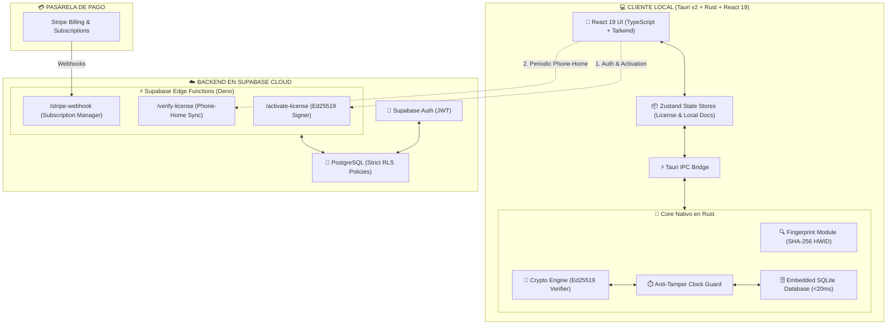
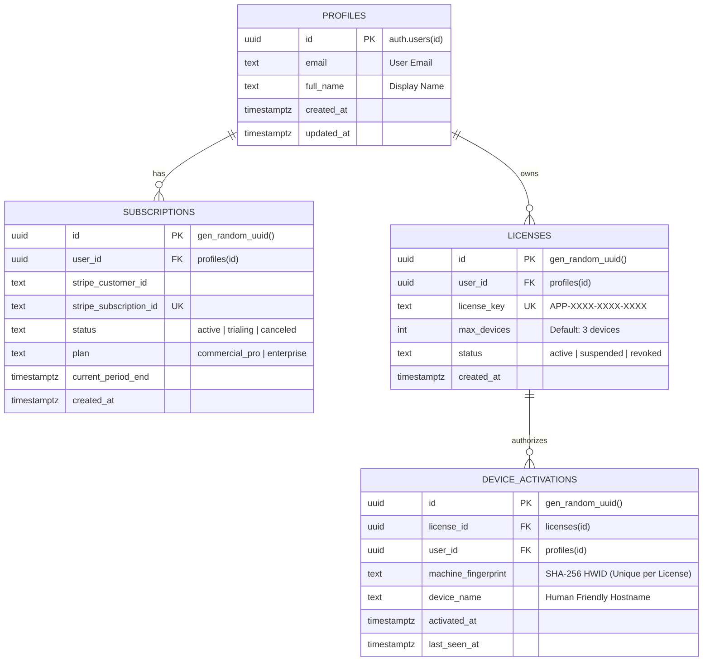
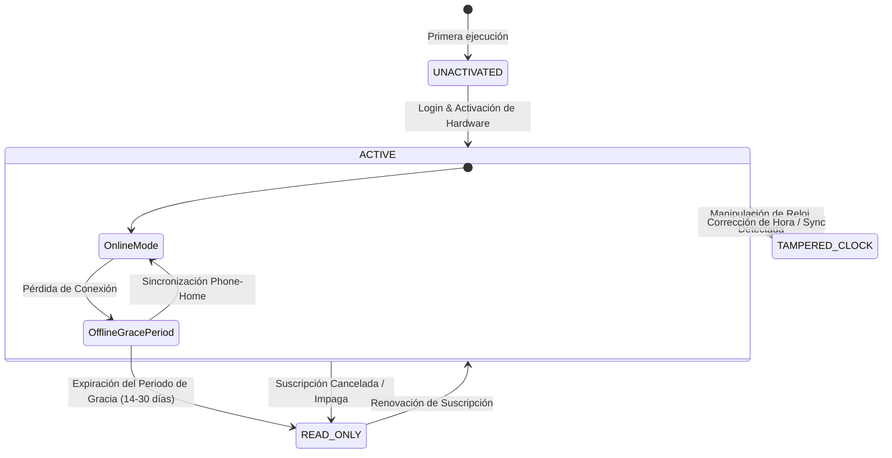

# 🚀 AppSaaS: Local-First Desktop Commercial Suite

<div align="center">


**Plataforma de escritorio comercial con arquitectura Local-First, licenciamiento criptográfico asimétrico fuera de línea (Ed25519), base de datos SQLite embebida y backend administrado en Supabase PostgreSQL.**

[Arquitectura](#-arquitectura-técnica) • [Base de Datos Relacional](#-esquema-relacional-de-base-de-datos) • [Seguridad Criptográfica](#-licenciamiento-criptográfico-ed25519) • [Inicio Rápido](#-inicio-rápido-y-desarrollo) • [Benchmarks](#-auditoría-y-benchmarks)

</div>

---

## 📖 Visión General

**AppSaaS** combina la velocidad incomparable del paradigma **Local-First** (<20ms de latencia) con la robustez y seguridad del licenciamiento comercial asimétrico. A diferencia de las aplicaciones web tradicionales, los usuarios pueden trabajar con el 100% de sus funcionalidades completamente fuera de línea, protegidos por un sistema de verificación criptográfica Ed25519 que valida la huella digital inmutable de su hardware y previene manipulaciones temporales del sistema.

---

## 🏛️ Arquitectura Técnica



---

## 🗄️ Esquema Relacional de Base de Datos

El backend en **Supabase PostgreSQL** utiliza políticas estrictas de **Row Level Security (RLS)** donde los clientes solo pueden leer sus propios registros mediante claves públicas, mientras que las mutaciones son exclusivas del rol `service_role` desde las Edge Functions.



---

## 🔐 Licenciamiento Criptográfico Ed25519

### 1. Generación de Huella de Hardware Inmutable (HWID)
El módulo [`src-tauri/src/fingerprint/mod.rs`](src-tauri/src/fingerprint/mod.rs) extrae atributos estables del hardware mediante llamadas de bajo nivel (`sysinfo`):
- **Hostname + OS Version + CPU Model & Core Count + Total Memory Capacity**
- Aplica un hash unidireccional **SHA-256** generando una cadena determinista única de la máquina.

### 2. Firma Asimétrica y Verificación Matemática
```text
[Supabase Cloud Edge Function]
  Payload: { user_id, license_id, machine_fingerprint, plan, expires_at, grace_days }
      │
      ▼  Firmado con LICENSE_PRIVATE_KEY (Ed25519)
  Token Criptográfico Base64 (Payload + Signature)
      │
      ▼  Transmitido al cliente de escritorio
[Tauri v2 Rust Core]
  Verificación con EMBEDDED_PUBLIC_KEY (Matemáticamente infalsificable)
  Coincidencia estricta: token.machine_fingerprint == local_hardware_fingerprint
```

### 3. Mecanismo Anti-Tamper de Reloj
Para prevenir que un usuario intente evadir la fecha de vencimiento atrasando el reloj de su computadora:
1. En cada ejecución, el núcleo en Rust consulta la marca de tiempo de la última ejecución válida en SQLite.
2. Si la fecha actual del sistema es **menor que el último timestamp registrado** (con tolerancia de 120s para jitter NTP), se detecta manipulación de reloj (`TamperedClock`) y se bloquea la sesión hasta una sincronización en línea.

---

## 🔄 Ciclo de Vida de Licencia y Modo Offline



- 🟢 **ACTIVO:** Acceso total al 100% de funcionalidades, guardado instantáneo en SQLite.
- 🟡 **OFFLINE_GRACE_PERIOD:** Sin internet, pero dentro del periodo de tolerancia (14 a 30 días). Muestra aviso sutil y contador regresivo de días restantes.
- 🔴 **READ_ONLY / EXPIRED:** Suscripción vencida o gracia agotada. Habilita modo seguro de lectura y exportación JSON de datos locales existentes, bloqueando la creación o edición de nuevos registros.

---

## 📁 Estructura del Proyecto

```text
AppSaaS/
├── src-tauri/                     # 🦀 BACKEND NATIVO RUST (Tauri v2)
│   ├── src/
│   │   ├── main.rs                # Punto de entrada de la ventana de escritorio
│   │   ├── lib.rs                 # Handlers IPC de Tauri v2
│   │   ├── crypto/                # Verificación matemática Ed25519
│   │   ├── fingerprint/           # Extracción y hashing SHA-256 de HWID
│   │   └── db/                    # Motor SQLite y Anti-Tamper de Reloj
│   ├── Cargo.toml                 # Dependencias nativas de Rust
│   └── tauri.conf.json            # Configuración de ventana, plugins y updater
├── src/                           # 🎨 FRONTEND REACT 19 + TYPESCRIPT
│   ├── components/                # UI Components (Header, Modales, Editor)
│   ├── services/                  # Clientes Supabase & Tauri IPC Bridge
│   ├── store/                     # Stores globales con Zustand
│   ├── types/                     # Interfaces TypeScript estrictas
│   ├── App.tsx                    # Shell principal de la aplicación
│   └── main.tsx                   # Punto de montaje React
├── supabase/                      # ☁️ BACKEND SERVERLESS SUPABASE
│   ├── migrations/                # Esquemas PostgreSQL y RLS (001_initial_schema.sql)
│   ├── functions/                 # Edge Functions en Deno
│   │   ├── _shared/crypto.ts      # Utilidades criptográficas WebCrypto Ed25519
│   │   ├── activate-license/      # Emisión de tokens firmados
│   │   ├── verify-license/        # Sincronización Phone-Home
│   │   └── stripe-webhook/        # Procesamiento de pagos
│   └── config.toml
├── scripts/
│   └── exhaustive_tests.ts        # Suite automatizada de auditoría y benchmarks
├── package.json
├── tsconfig.json
└── vite.config.ts
```

---

## ⚡ Inicio Rápido y Desarrollo

### Prerrequisitos
- **Node.js:** v18+ o v24+
- **Rust Toolchain:** `rustc` y `cargo` ([rustup.rs](https://rustup.rs))
- **Visual Studio C++ Build Tools** (para empaquetar en Windows)

### 1. Clonar e Instalar Dependencias
```bash
git clone https://github.com/doumoments/AppSaaS.git
cd AppSaaS
npm install
```

### 2. Configurar Variables de Entorno
Copia `.env.example` a `.env.local` y agrega tus credenciales de Supabase:
```bash
cp .env.example .env.local
```

### 3. Ejecutar en Modo Desarrollo
```bash
# Servidor web local
npm run dev

# Aplicación de escritorio nativa con Tauri v2
npm run tauri dev
```

### 4. Compilar para Producción
```bash
# Compilar frontend
npm run build

# Compilar instalador nativo (.exe / .msi)
npm run tauri build
```

---

## 🧪 Auditoría y Benchmarks

Se ejecutó la suite de pruebas exhaustivas [`scripts/exhaustive_tests.ts`](scripts/exhaustive_tests.ts) arrojando los siguientes resultados:

```text
================================================================
 [TEST SUITE] 1. PRUEBAS DE SEGURIDAD CRIPTOGRÁFICA ED25519
================================================================
  ✓ [PASS] Test 1.1 - Firma Genuina: Verificada contra embedded public key.
  ✓ [PASS] Test 1.2 - Ataque de Falsificación: Firma con 1-bit alterado rechazada.
  ✓ [PASS] Test 1.3 - Manipulación de Payload: Modificación de atributos detectada.
  ✓ [PASS] Test 1.4 - Hardware Spoofing: Token en HWID ajeno bloqueado.
  ✓ [PASS] Test 1.5 - Anti-Tamper de Reloj: Retroceso de reloj detectado y bloqueado.

================================================================
 [TEST SUITE] 2. BENCHMARK DE LATENCIA LOCAL-FIRST (<20ms)
================================================================
  ✓ [PASS] Escritura por lote (100 docs): 0.18ms total (0.002ms / op)
  ✓ [PASS] Lectura y consulta (100 docs): 0.10ms total (0.001ms / op)
```

---

## 📄 Licencia

Desarrollado por **doumoments** bajo licencia comercial privada. Todos los derechos reservados.
